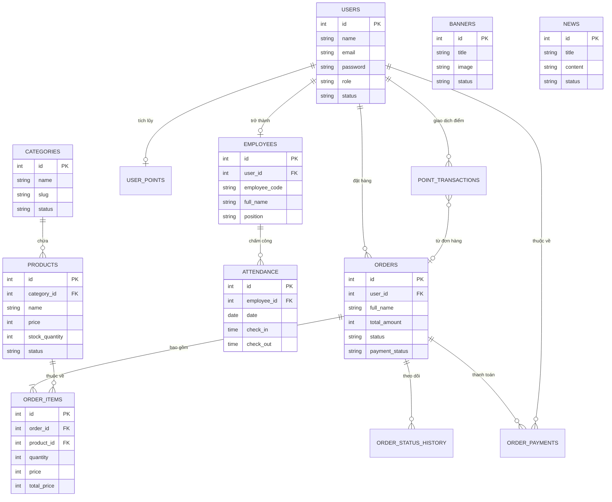

# DANH SÁCH CÁC THỰC THỂ TRONG DỰ ÁN

### 4.3.5 Thực thể loại hàng hóa

| LOAIHANGHOA  |                               |
| :----------- | :---------------------------- |
| **id**       | <i>Integer <pi></i>           |
| name         | Variable characters (255) <M> |
| slug         | Variable characters (255)     |
| description  | Text                          |
| status       | Enum ('active', 'inactive')   |
| identifier_1 | <pi>                          |

**Bảng 4.3.5 Thực thể loại hàng**

- Tên thực thể: LOAIHANGHOA (categories)
- Khóa thực thể: id
- Các thuộc tính của thực thể:
  - id: mã loại hàng
  - name: tên loại hàng
  - slug: đường dẫn tĩnh
  - description: mô tả
  - status: trạng thái hoạt động

---

### 4.3.6 Thực thể ca làm việc (Chấm công)

| CALAMVIEC    |                                    |
| :----------- | :--------------------------------- |
| **id**       | <i>Integer <pi></i>                |
| employee_id  | Integer <M>                        |
| date         | Date <M>                           |
| check_in     | Time                               |
| check_out    | Time                               |
| total_hours  | Decimal (5,2)                      |
| daily_wage   | Integer                            |
| status       | Enum ('present', 'late', 'absent') |
| identifier_1 | <pi>                               |

**Bảng 4.3.6 Thực thể ca làm việc**

- Tên thực thể: CALAMVIEC (attendance)
- Khóa thực thể: id
- Các thuộc tính của thực thể:
  - id: mã định danh chấm công
  - employee_id: mã nhân viên
  - date: ngày chấm công
  - check_in: giờ vào
  - check_out: giờ ra
  - total_hours: tổng giờ làm
  - daily_wage: tiền lương trong ngày
  - status: trạng thái (hiện diện, muộn, vắng)

---

### 4.3.7 Thực thể hóa đơn bán hàng

| HOADONBANHANG   |                                                          |
| :-------------- | :------------------------------------------------------- |
| **id**          | <i>Integer <pi></i>                                      |
| user_id         | Integer                                                  |
| full_name       | Variable characters (255) <M>                            |
| total_amount    | Integer <M>                                              |
| status          | Enum ('pending', 'processing', 'completed', 'cancelled') |
| payment_status  | Enum ('pending', 'paid', 'failed')                       |
| points_redeemed | Integer                                                  |
| discount_amount | Integer                                                  |
| identifier_1    | <pi>                                                     |

**Bảng 4.3.7 Thực thể hóa đơn bán hàng**

- Tên thực thể: HOADONBANHANG (orders)
- Khóa thực thể: id
- Các thuộc tính của thực thể:
  - id: mã hóa đơn
  - user_id: mã người mua (nếu là thành viên)
  - full_name: tên khách hàng
  - total_amount: tổng tiền thanh toán
  - status: trạng thái đơn hàng
  - payment_status: trạng thái thanh toán
  - points_redeemed: số điểm đã dùng
  - discount_amount: số tiền được giảm

---

### 4.3.8 Thực thể sản phẩm

| SANPHAM        |                               |
| :------------- | :---------------------------- |
| **id**         | <i>Integer <pi></i>           |
| category_id    | Integer <M>                   |
| name           | Variable characters (255) <M> |
| price          | Integer <M>                   |
| sale_price     | Integer                       |
| stock_quantity | Integer                       |
| identifier_1   | <pi>                          |

**Bảng 4.3.8 Thực thể sản phẩm**

- Tên thực thể: SANPHAM (products)
- Khóa thực thể: id
- Các thuộc tính của thực thể:
  - id: mã sản phẩm
  - category_id: mã danh mục
  - name: tên sản phẩm
  - price: giá bán gốc
  - sale_price: giá khuyến mãi
  - stock_quantity: số lượng tồn kho

---

### 4.3.9 Thực thể nhân viên

| NHANVIEN      |                               |
| :------------ | :---------------------------- |
| **id**        | <i>Integer <pi></i>           |
| employee_code | Variable characters (50) <M>  |
| full_name     | Variable characters (255) <M> |
| position      | Variable characters (100)     |
| salary        | Integer                       |
| hourly_rate   | Integer                       |
| status        | Enum ('active', 'inactive')   |
| identifier_1  | <pi>                          |

**Bảng 4.3.9 Thực thể nhân viên**

- Tên thực thể: NHANVIEN (employees)
- Khóa thực thể: id
- Các thuộc tính của thực thể:
  - id: mã định danh
  - employee_code: mã số nhân viên
  - full_name: họ và tên
  - position: chức vụ
  - salary: lương cơ bản
  - hourly_rate: lương theo giờ
  - status: trạng thái làm việc

---

### 4.3.10 Thực thể người dùng

| NGUOIDUNG    |                                 |
| :----------- | :------------------------------ |
| **id**       | <i>Integer <pi></i>             |
| name         | Variable characters (255) <M>   |
| email        | Variable characters (255) <M>   |
| role         | Enum ('admin', 'staff', 'user') |
| status       | Enum ('active', 'inactive')     |
| identifier_1 | <pi>                            |

**Bảng 4.3.10 Thực thể người dùng**

- Tên thực thể: NGUOIDUNG (users)
- Khóa thực thể: id
- Các thuộc tính của thực thể:
  - id: mã người dùng
  - name: tên đăng nhập/tên hiển thị
  - email: địa chỉ email
  - role: vai trò trong hệ thống
  - status: trạng thái tài khoản

---

## 4.7 MÔ HÌNH CƠ SỞ DỮ LIỆU

**Mô tả các mối quan hệ chính:**

1.  **USERS - ORDERS**: Một người dùng có thể thực hiện nhiều đơn hàng (1-N).
2.  **CATEGORIES - PRODUCTS**: Một danh mục chứa nhiều sản phẩm (1-N).
3.  **ORDERS - ORDER_ITEMS**: Một đơn hàng chứa nhiều chi tiết sản phẩm khách mua (1-N).
4.  **PRODUCTS - ORDER_ITEMS**: Một sản phẩm có thể xuất hiện trong nhiều chi tiết đơn hàng khác nhau (1-N).
5.  **USERS - EMPLOYEES**: Một tài khoản người dùng có thể là hồ sơ của một nhân viên (1-1/1-0).
6.  **EMPLOYEES - ATTENDANCE**: Một nhân viên có nhiều bản ghi chấm công hàng ngày (1-N).
